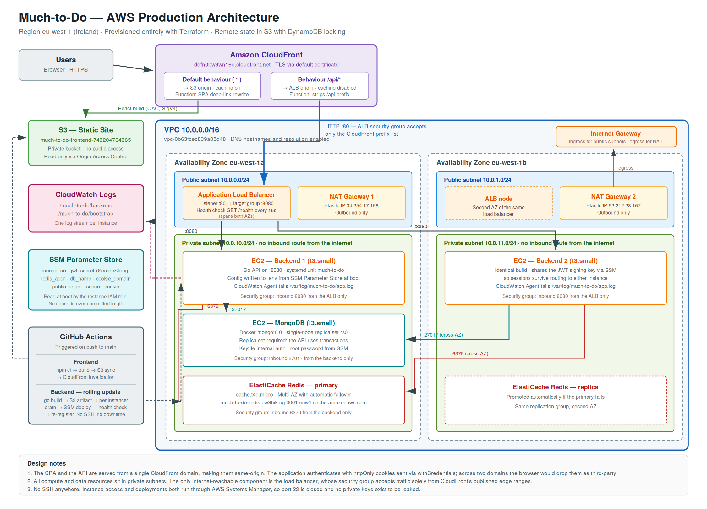

# much-to-do-infra

Terraform configuration that provisions the production environment for the
**Much-to-Do** task management application on AWS.

Everything in the account is created from this repository. The only resources
created by hand are the S3 bucket and DynamoDB table that hold Terraform's own
remote state, which the project brief explicitly permits.

- **Live application:** https://ddfn0bw9wn16q.cloudfront.net
- **Application repository:** https://github.com/Reenatechie/much-to-do
- **Region:** eu-west-1 (Ireland)

---

## Architecture



### Request path

A single CloudFront distribution serves both halves of the application:

| Path | Origin | Behaviour |
|---|---|---|
| `/*` | S3 (private, via Origin Access Control) | Cached; a CloudFront Function rewrites extensionless paths to `index.html` for client-side routing |
| `/api/*` | Application Load Balancer | Never cached; a CloudFront Function strips the `/api` prefix, and all headers, cookies and query strings are forwarded |

**Why one domain rather than two.** The application authenticates with
`httpOnly` cookies, and its axios client sends them using `withCredentials`.
If the SPA and the API lived on separate domains the browser would classify
that cookie as third-party and silently drop it, so every request after login
would return 401. Pointing an HTTPS page at an HTTP load balancer would also
be blocked as mixed content. Serving both from one CloudFront domain makes
them same-origin, which removes the cookie problem, removes CORS entirely, and
provides TLS without requiring a registered domain name.

### Layout

- **VPC** `10.0.0.0/16` across two availability zones
- **Public subnets** `10.0.0.0/24`, `10.0.1.0/24` — load balancer and NAT gateways
- **Private subnets** `10.0.10.0/24`, `10.0.11.0/24` — application, database and cache
- **Two NAT gateways**, one per AZ, so losing a zone does not cut outbound access
- **Two backend EC2 instances**, one per AZ, registered to a single target group

---

## Repository layout

```
.
├── backend.tf              # S3 remote state + DynamoDB state locking
├── providers.tf            # AWS provider and default tags
├── versions.tf             # Required Terraform and provider versions
├── variables.tf            # All tunable inputs
├── main.tf                 # Wires the modules together
├── outputs.tf              # Live URL, credentials, resource identifiers
└── modules/
    ├── network/            # VPC, subnets, IGW, NAT gateways, route tables
    ├── security/           # One security group per tier
    ├── data/               # MongoDB on EC2, ElastiCache Redis, secrets
    ├── compute/            # Backend instances, ALB, CloudWatch, artifacts bucket
    ├── frontend/           # S3 site bucket, CloudFront, edge functions
    ├── cicd/               # Deployment identity and pipeline parameters
    └── assessor/           # Read-only IAM user for review
```

---

## Prerequisites

- Terraform >= 1.6
- AWS CLI v2, configured with credentials that can create the resources below
- An S3 bucket and DynamoDB table for state (see below)

### Creating the state backend

This is the one manual step, and it exists because Terraform cannot store its
own state in infrastructure it has not created yet.

```bash
export AWS_REGION=eu-west-1
export TF_BUCKET=much-to-do-tfstate-reena2026

aws s3api create-bucket --bucket "$TF_BUCKET" --region "$AWS_REGION" \
  --create-bucket-configuration LocationConstraint="$AWS_REGION"

aws s3api put-bucket-versioning --bucket "$TF_BUCKET" \
  --versioning-configuration Status=Enabled

aws dynamodb create-table --table-name much-to-do-tflock \
  --attribute-definitions AttributeName=LockID,AttributeType=S \
  --key-schema AttributeName=LockID,KeyType=HASH \
  --billing-mode PAY_PER_REQUEST --region "$AWS_REGION"
```

Then update `backend.tf` if you chose different names.

---

## Deploying

```bash
terraform init
terraform plan
terraform apply
```

A cold apply takes roughly 20 minutes. ElastiCache and CloudFront account for
most of that. The backend instances need a further 6–8 minutes after apply
completes: on first boot they install Go, clone the application repository and
compile the API before the load balancer marks them healthy.

Watch them come into service:

```bash
aws elbv2 describe-target-health \
  --target-group-arn $(aws elbv2 describe-target-groups --names much-to-do-tg \
    --query 'TargetGroups[0].TargetGroupArn' --output text) \
  --query 'TargetHealthDescriptions[].[Target.Id,TargetHealth.State]' --output table
```

Verify the whole chain in one request:

```bash
curl $(terraform output -raw live_url)/api/health
# {"cache":"ok","database":"ok"}
```

That single response confirms CloudFront routing, the load balancer, an
instance in a private subnet, MongoDB and Redis are all working.

### Useful outputs

```bash
terraform output live_url                 # the public application URL
terraform output alb_dns_name             # load balancer DNS name
terraform output app_instance_ids         # backend instance IDs
terraform output log_group_name           # CloudWatch log group
terraform output -raw assessor_console_password
```

---

## Design decisions

### MongoDB is a single-node replica set, not a standalone server

`internal/handlers/user.go` deletes an account inside a
`session.WithTransaction` block. MongoDB rejects transactions on a standalone
`mongod`, so the instance runs with `--replSet rs0` and is initiated at boot.
Enabling both replication and access control obliges MongoDB to use a keyfile
for internal authentication, which the bootstrap script generates.

### Configuration is written as a `.env` file, not exported as environment variables

The application loads configuration through Viper, calling `AutomaticEnv()` and
then `Unmarshal()`. `AutomaticEnv` only affects `Get()`; `Unmarshal` populates
fields from keys Viper already knows about via a config file or a registered
default. `MONGO_URI`, `DB_NAME`, `JWT_SECRET_KEY` and `REDIS_ADDR` have
neither, so environment variables alone arrive empty and the process exits at
startup. Each instance therefore generates `/opt/much-to-do/.env` at boot from
Parameter Store, and the systemd unit sets `WorkingDirectory` accordingly.

### The JWT signing key is shared, not per-instance

Both backends read the same `SecureString` parameter. If each generated its own
key, a session established through one instance would be rejected the moment
the load balancer routed the user to the other, which would defeat the whole
point of running two.

### There is no SSH access

Port 22 is closed on every security group and no key pair exists. Interactive
access and deployments both run through AWS Systems Manager, so there are no
private keys to distribute, rotate or leak. The instances sit in private
subnets and reach Systems Manager outbound through the NAT gateways.

### Health checks hit `/health`, not a static endpoint

`/health` reports on MongoDB and Redis connectivity, so an instance that has
lost a dependency is removed from rotation automatically rather than
continuing to serve failing requests.

---

## Security

| Control | Implementation |
|---|---|
| Compute isolation | Both backend instances and both databases sit in private subnets with no inbound route from the internet |
| Load balancer exposure | The ALB security group accepts port 80 only from `com.amazonaws.global.cloudfront.origin-facing`, AWS's published list of CloudFront edge ranges |
| Tier isolation | Backend accepts 8080 from the ALB security group only; MongoDB accepts 27017 and Redis 6379 from the backend security group only |
| Secrets | Generated by Terraform, stored as `SecureString` parameters, read at boot by the instance role. None appear in this repository |
| State | Remote, encrypted and versioned in S3, locked through DynamoDB. `*.tfstate` is gitignored |
| Bucket access | Both S3 buckets block all public access. The site bucket is readable only by this CloudFront distribution, enforced by an `AWS:SourceArn` condition |
| Encryption | EBS volumes, both S3 buckets and ElastiCache at-rest storage are all encrypted |
| Deployment identity | A dedicated IAM user whose policy permits writing to two named buckets, invalidating one distribution, and running commands only on instances tagged `DeployGroup=much-to-do`. It cannot create or modify infrastructure |
| Instance metadata | IMDSv2 required on all instances |

A GitHub OIDC provider and role are also provisioned as the preferred
credential-free approach. The pipelines currently authenticate with the scoped
IAM user described above, whose keys are held in GitHub repository secrets.

---

## Cost

Roughly **£4–6 per day**, dominated by the two NAT gateways, the load balancer
and three EC2 instances. To remove everything:

```bash
terraform destroy
```

Delete the state bucket and lock table separately afterwards, as those were
created outside Terraform.

---

## Known limitations

- CloudFront reaches the load balancer over HTTP. End-to-end TLS would need a
  registered domain and an ACM certificate on the listener.
- MongoDB is a single node. It is a replica set for transaction support, not
  for redundancy; losing that instance loses the database.
- The backend instances are managed individually rather than by an Auto Scaling
  group, which keeps the failover demonstration deterministic but means a
  terminated instance is not replaced automatically.
